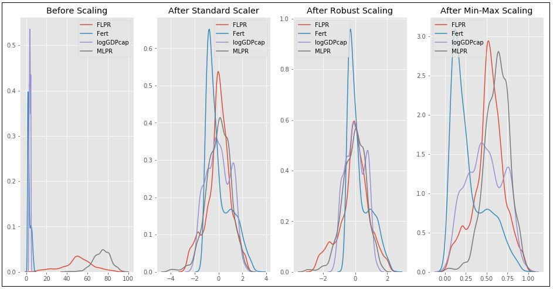
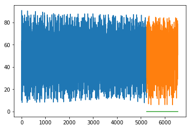

```{r setup, include=FALSE}
knitr::opts_chunk$set(
  results = 'asis',
  echo = FALSE,
  warning = FALSE,
  message = FALSE,
  fig.align = 'center'
)

#Load libraries
library(tidyverse)
library(gapminder)
library(gganimate)
library(kableExtra)
```

## Introduction
Environmental economist interested in water-energy-food nexus, agricultural development, water economics and policy, gender issues.

## My Synthesis Project
Past academic studies that have looked into cross-country data indicated that the relationship between women's labour participation (WLPR) and economic development is linear or curvilinear. This relationship is expressed in the popular U-shaped hypothesis which presumes a kind of trade-off between economic growth and women's labour participation in the course of a country's development (figure below).

```{r message=FALSE, out.extra='class="anim"', cache = T}
data_anime <- read.csv("resources/data_anime.csv")
s <- ggplot(data_anime, aes(x=log10(LogGDPcap), y=FLPR)) + 
  geom_point(color='blue', shape=20, size=3, alpha = 0.8) +
  geom_text(size=3,aes(label=Country), hjust=1, vjust=1, angle=1, check_overlap = TRUE) +
#  geom_smooth(method='lm', formula = y~poly(x,2), color="blue", se=FALSE) + 
  xlim(c(2.50, 5.50)) + 
  ylim(c(0, 100)) +
  labs(subtitle="Countries of the word - relationship between women's labour participation
       and economic development (1990-2016)", 
       y="Women's labor participaton rate", 
       x="Log of GDP per capita (PPP adjusted 2011 constant international $)", 
       title="", 
       caption = "Based on the World Development Indicators") +
 theme(legend.position = "none", panel.border = element_rect(colour = "black", fill=NA, size=1),)
s + transition_time(year, range = c(1990L, 2016L)) +
  labs(title = "Year: {frame_time}")
```

```{r, out.extra='class="hardcopy"', out.width="80%"}
data_anime %>% 
  filter(year == 2015) %>% 
  ggplot(aes(x=log10(LogGDPcap), y=FLPR)) + 
  geom_point(color='blue', shape=20, size=3, alpha = 0.8) +
  geom_text(size=3,aes(label=Country), hjust=1, vjust=1, angle=1, check_overlap = TRUE) +
#  geom_smooth(method='lm', formula = y~poly(x,2), color="blue", se=FALSE) + 
  xlim(c(2.50, 5.50)) + 
  ylim(c(0, 100)) +
  labs(subtitle="Countries of the word - relationship between women's labour participation
       and economic development (1990-2016)", 
       y="Women's labor participaton rate", 
       x="Log of GDP per capita (PPP adjusted 2011 constant international $)", 
       title="Year: 2015", 
       caption = "Based on the World Development Indicators") +
 theme(legend.position = "none", panel.border = element_rect(colour = "black", fill=NA, size=1),)
```


**Objective of the project is to use machine learning (ML) technique to predict drivers of WLPR (with Principal Component and Exploratory Factor Analysis) and its linkage with GDP per capita across countries.**

## My Digital Toolbox
The project has been divided into three stages:

**Stage 1. Data processing.**
The dataset obtained from the World Development Indicators. It covers 183 countries for 1990-2016 (383 features). Data processing included: data tidying and handling missing data (MD). Variables with >20% MD have been deleted (81 features retained). The rest MD have been imputed by Multiple Imputation by Chained Equations (MICE) technique with Classification and Regression Tree method (CART, m=5,maxit=50). However, MICE has limitation in data imputation (figure below show before and after MICE, yellow indicates MD). Therefore, for the rest MD mean value imputation has been used.


<br/>
**Stage 2. Data scaling and normalization.**
Fertility rate, men's labour participation and GDP per capita were identified as main drivers of WLPR. To employ ML algorithm in the next stage data must be scaled and normalized. Thus, identified drivers have been scaled by three techniques (standard, min-max and robust).



**Stage 3. Machine learning algoritm application.**
Regression technique has been used to predict WLPR based on GDP per capita with different training and testing sample size. The most representative with 70/30 ratio yielded RMS=53.6 (orange are predicted values).



R packages (tidyverse, dplyr, ggplot2, psych, gridExtra, ggpubr, data.table, pairedData, mice, VIM) was used in the first stage and Python packages (pandas, numpy, sklearn, matplotlib, seaborn, ggplot, plotly) in the second and third stages.

## My time went ...

The most challenging part of the project was ML itself as three days spent for it during Data School was not enough. Therefore, the first couple of weeks I spent on learning ML algorithms. Data preparation took a significant part of time as well (roughly 70-80% of the whole project time).

Although I run PCA/EFA but their results were not satisfactory therefore my next plan is to run PCA/EFA to reduce dimension of the initial dataset and employ other ML algorthms for similar prediction.

# My Data School Experience

- Best investment (already using for the research, switched to R from SAS and SPSS).
- Planning to conduct training for students in SA within project's scope.
- Interaction with instructors and with the team.
